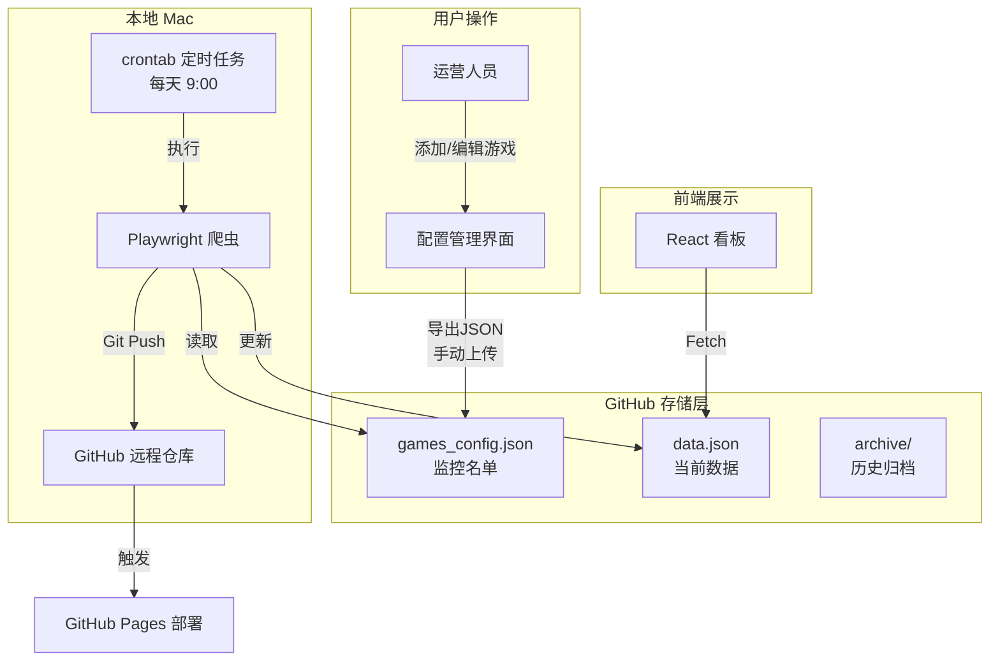
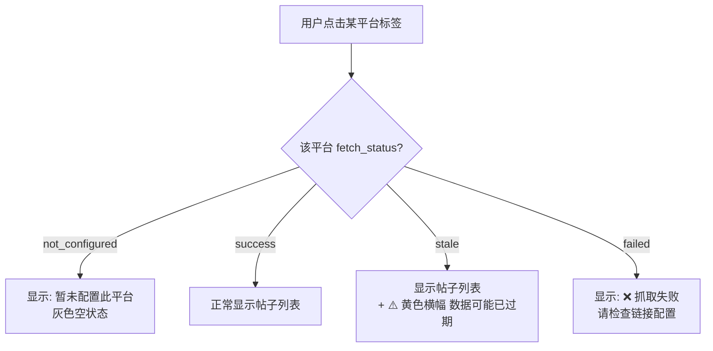

# GitHub Serverless 竞品监控系统 - 技术蓝图 v2.2

> 核心目标：基于本地定时任务 + GitHub Pages 实现低成本、全自动、可维护的游戏竞品数据监控。

---

## 1. 系统架构

### 1.1 逻辑架构

采用 **本地爬虫 + GitHub 存储** 设计，利用 Mac 定时任务执行爬虫，GitHub 作为存储和部署节点。



### 1.2 技术栈选择

| 层级 | 技术选型 |
|------|----------|
| 前端 | React 18 + Tailwind CSS (Vite 构建) |
| 爬虫 | Python 3.9 + **Playwright**（浏览器渲染，应对 CSR 页面） |
| 定时任务 | Mac crontab（每天 9:00 自动执行） |
| 存储 | JSON 文件 (Git 版本控制) |
| 部署 | GitHub Pages |

### 1.3 技术方案选型说明

**为什么使用 Playwright 而非 Requests？**

TapTap 等平台采用了多重反爬机制：
- **CSR 动态渲染**：页面数据由 JavaScript 动态加载，纯 HTTP 请求无法获取
- **签名验证**：API 请求需要 `X-Tap-Sign`（HMAC-SHA256）和 `X-UA`（设备指纹）
- **TLS 指纹检测**：服务端检测 JA3 指纹，识别非浏览器请求

**为什么使用本地定时任务而非 GitHub Actions？**

- GitHub Actions 的 IP 容易被平台封禁
- 本地真实浏览器环境更接近正常用户，不易触发反爬
- 家用宽带 IP 更稳定，抓取成功率更高

---

## 2. 核心业务规则

| 规则项 | 确认内容 |
|--------|----------|
| 配置模式 | **本地模式**：网页填表 → 导出 JSON → 手动上传 GitHub |
| 数据保留 | 30 天内数据在 `data.json`；超过 30 天按月归档到 `archive/`，暂不在前端展示 |
| 抓取状态 | 需要显示，让运营知道数据是否过期 |
| 平台展示 | 4 个标签页（TapTap/B站/微博/小红书）固定显示；未配置显示"暂未配置"；已配置但失败显示警告 |
| NEW 标签 | 按**自然周**计算：周一 00:00 ~ 周日 23:59 内发布的帖子，在本周内都显示 NEW；下周一自动消失 |
| 多用户 | 内部公开看板，无需登录 |
| 告警通知 | 后续迭代考虑（邮件/企微/钉钉） |

---

## 3. 核心数据结构 (Schema)

### 3.1 配置文件：`games_config.json`

监控名单配置，由运营通过前端配置界面导出后手动上传。

```json
[
  {
    "id": "naraka",
    "name": "永劫无间",
    "icon_url": "https://example.com/icon.png",
    "enabled": true,
    "platforms": {
      "taptap": { "url": "https://www.taptap.cn/app/123456" },
      "bilibili": { "url": "https://www.bilibili.com/game/123" },
      "weibo": { "url": "https://weibo.com/u/123456" },
      "xiaohongshu": { "url": "https://www.xiaohongshu.com/user/profile/xxx" }
    },
    "created_at": "2025-01-15"
  }
]
```

**字段说明**：

| 字段 | 类型 | 必填 | 说明 |
|------|------|------|------|
| id | string | ✅ | 唯一标识，不可重复 |
| name | string | ✅ | 游戏显示名称 |
| icon_url | string | ❌ | 图标 URL，不填则显示首字符 |
| enabled | boolean | ✅ | 是否启用监控 |
| platforms.taptap.url | string | ❌ | TapTap 游戏主页链接 |
| platforms.bilibili.url | string | ❌ | B站游戏专题页链接 |
| platforms.weibo.url | string | ❌ | 微博官方账号主页链接 |
| platforms.xiaohongshu.url | string | ❌ | 小红书官方账号主页链接 |
| created_at | string | ✅ | 添加日期 (ISO 格式) |

### 3.2 数据文件：`public/data.json`

爬虫每日生成的监控数据，前端直接读取展示。

```json
[
  {
    "id": "naraka",
    "name": "永劫无间",
    "icon_char": "永",
    "last_updated": "2025-01-15 08:00",

    "fetch_status": {
      "taptap": "success",
      "bilibili": "stale",
      "weibo": "failed",
      "xiaohongshu": "not_configured"
    },

    "basic_info": {
      "status": "预约中",
      "rating": 9.5,
      "reservations": 1200000,
      "followers": 450000,
      "review_count": 8500,
      "tags": ["动作", "多人", "竞技"],
      "diffs": {
        "reservations": { "day": "+5.2k", "week": "+32k", "month": "+80k" },
        "rating": { "day": "0", "week": "+0.1", "month": "-0.2" },
        "followers": { "day": "+1.2k", "week": "+8k", "month": "+25k" },
        "review_count": { "day": "+56", "week": "+320", "month": "+1.2k" }
      }
    },

    "trend_history": {
      "dates": ["12-16", "12-17", "12-18"],
      "reservations": [1100000, 1150000, 1200000],
      "rating": [9.4, 9.5, 9.5]
    },

    "official_posts": {
      "taptap": [
        {
          "id": "post_123",
          "title": "新版本更新公告",
          "url": "https://www.taptap.cn/post/123",
          "date": "2025-01-14",
          "is_new": true,
          "comments": 128,
          "likes": 2340
        }
      ],
      "bilibili": [],
      "weibo": [],
      "xiaohongshu": []
    },

    "hot_reviews": [
      {
        "id": "review_456",
        "platform": "taptap",
        "user": "玩家小明",
        "content": "画面很精美，打击感不错...",
        "score": 5,
        "date": "2025-01-13",
        "likes": 89,
        "replies": 12,
        "is_new": true
      }
    ]
  }
]
```

**fetch_status 枚举值**：

| 值 | 含义 | 前端展示 |
|----|------|----------|
| `success` | 抓取成功 | 正常显示数据 |
| `stale` | 抓取失败，复用旧数据 | 显示数据 + ⚠️ 黄色警告"数据可能已过期" |
| `failed` | 连续多次失败 | ❌ 红色警告"抓取失败，请检查链接配置" |
| `not_configured` | 未配置该平台 | 灰色空状态"暂未配置此平台" |

### 3.3 归档文件：`archive/YYYY-MM.json`

每月历史数据归档，暂仅备份不展示。

```json
{
  "month": "2025-01",
  "archived_at": "2025-02-01 00:00",
  "games": {
    "naraka": {
      "daily_snapshots": [
        {
          "date": "2025-01-01",
          "reservations": 1000000,
          "rating": 9.3,
          "followers": 400000
        }
      ]
    }
  }
}
```

---

## 4. 前端状态展示逻辑

### 4.1 平台标签页状态流转



### 4.2 NEW 标签计算规则

**爬虫端计算逻辑**：

```
当前日期: 2025-01-15 (周三)
本周范围: 2025-01-13 (周一 00:00) ~ 2025-01-19 (周日 23:59)

帖子发布日期 2025-01-14 → is_new = true  (在本周内)
帖子发布日期 2025-01-10 → is_new = false (上周五，不在本周)
```

---

## 5. 核心模块设计

### 5.1 爬虫模块 (`crawler/`)

**模块职责**：

1. **读取配置**：从 `games_config.json` 获取监控名单和平台链接
2. **采集数据**：使用 Playwright 渲染页面，通过 JavaScript 注入提取 DOM 数据
3. **计算处理**：
   - 读取旧 `data.json` 中的 `trend_history`
   - 将今日数据追加到 history 数组（维持长度 <= 30）
   - 计算 `diffs` (今日 vs 昨日/7日前/30日前)
   - 根据自然周规则计算 `is_new`
4. **状态标记**：设置 `fetch_status`，区分成功/失败/未配置
5. **降级处理**：若某平台抓取失败，复用旧数据并标记 `stale`

**TapTap 抓取技术方案**：

| 数据类型 | 页面 URL | 提取方式 |
|----------|----------|----------|
| 基础数据 | `/app/{id}?os=android` | JS 注入提取 DOM 文本 |
| 官方帖子 | `/app/{id}/topic?type=official` | JS 注入遍历帖子卡片 |
| 热门评论 | `/app/{id}/review?os=android` | JS 注入提取评论卡片 + SVG 宽度计算评星 |

**数据提取示例（评星计算）**：

```javascript
// TapTap 评星使用 SVG 前景/背景层叠加实现
// 通过前景层宽度 / 背景层宽度 计算实际星数
const score = Math.round((foregroundWidth / backgroundWidth) * 5);
```

### 5.2 自动化模块

**本地定时任务（Mac crontab）**：

- 配置文件：`scripts/daily_crawl.sh`
- 触发时间：每天 9:00（Mac 需处于开机/唤醒状态）
- 执行流程：运行爬虫 → Git Commit → Git Push

```bash
# crontab 配置
0 9 * * * /bin/bash /path/to/echo_cms/scripts/daily_crawl.sh
```

**daily_crawl.sh 脚本逻辑**：

```bash
1. 进入项目目录
2. 运行 Python 爬虫 (python3 crawler/main.py)
3. Git add public/data.json
4. Git commit -m "data: 每日数据更新 YYYY-MM-DD"
5. Git push
6. 记录日志到 logs/crawl_YYYYMMDD.log
```

**GitHub Pages 部署（deploy_web.yml）**：

- 触发：Push to `main`
- 逻辑：Build React → 部署到 `gh-pages`

---

## 6. 实施路线图

### 阶段一：前端工程化 + 配置管理 MVP（Day 1-2）

| # | 任务 | 产出物 | 预计耗时 |
|---|------|--------|----------|
| 1 | 初始化 Vite + React + Tailwind 项目 | 可运行的空项目 | 0.5h |
| 2 | 迁移 `App.jsx` 到新项目，确保 UI 正常 | 页面可访问 | 0.5h |
| 3 | **字段重命名**：将 `game.title` 改为 `game.name`（详见下方修改清单） | 代码与 Schema 对齐 | 0.5h |
| 4 | 创建 Mock 数据 `public/data.json`（含 2 款示例游戏，包含 `fetch_status`） | 符合新 Schema 的测试数据 | 0.5h |
| 5 | **实现 `fetch_status` 状态展示**：平台标签页根据状态显示不同 UI（详见下方修改清单） | 标签页显示正确状态 | 1h |
| 6 | 新增"配置管理"入口按钮（Header 右侧） | 按钮可点击 | 0.5h |
| 7 | 实现配置管理弹窗：游戏列表 + 添加/编辑表单 | 弹窗 UI 完成 | 2h |
| 8 | 实现"导出 JSON"功能 | 点击下载 `games_config.json` | 0.5h |
| 9 | 实现"导入 JSON"功能（加载已有配置） | 可读取并展示 | 0.5h |

**阶段一总计：约 7 小时**

---

#### 📝 App.jsx 修改清单（阶段一）

**修改点 1：字段重命名 `title` → `name`**

| 文件位置 | 原代码 | 改为 |
|----------|--------|------|
| FALLBACK_DATA (约第 50 行) | `"title": "示例游戏..."` | `"name": "示例游戏..."` |
| GameColumn 头部 (约第 204 行) | `game.icon_char \|\| game.title[0]` | `game.icon_char \|\| game.name[0]` |
| GameColumn 头部 (约第 207 行) | `{game.title}` | `{game.name}` |

**修改点 2：实现 `fetch_status` 状态展示**

在"官方动态"板块的平台内容区域（约第 327-340 行），根据 `fetch_status` 显示不同状态：

| fetch_status 值 | 展示效果 |
|-----------------|----------|
| `not_configured` | 灰色空状态："暂未配置此平台" + 引导文案 |
| `success` | 正常显示帖子列表 |
| `stale` | 显示帖子列表 + 顶部黄色警告条："⚠️ 数据可能已过期" |
| `failed` | 红色错误状态："❌ 抓取失败，请检查链接配置" |

**参考实现逻辑**：

```
读取: game.fetch_status[activePlatform]

判断顺序:
1. 若为 "not_configured" → 显示灰色空状态
2. 若为 "failed" → 显示红色错误
3. 若为 "stale" → 显示黄色警告条 + 帖子列表
4. 若为 "success" → 正常显示帖子列表
5. 若帖子列表为空 → 显示 "暂无动态"
```

### 阶段二：爬虫与数据处理（Day 3-5）

| # | 任务 | 状态 |
|---|------|------|
| 1 | 完成 `main.py` 框架 | ✅ |
| 2 | 实现 TapTap 平台抓取（Playwright + JS 注入） | ✅ |
| 3 | 实现 `trend_history` 追加逻辑（维持 30 天） | ⚪ |
| 4 | 实现 `diffs` 计算逻辑 | ⚪ |
| 5 | 实现 `is_new` 自然周计算逻辑 | ⚪ |
| 6 | 实现 `fetch_status` 状态标记 | ✅ |
| 7 | 本地验证：`python main.py` 正确更新 `data.json` | ✅ |

### 阶段三：自动化与部署（Day 6）

| # | 任务 | 状态 |
|---|------|------|
| 1 | 配置本地定时任务（Mac crontab） | ✅ |
| 2 | 创建 `daily_crawl.sh` 执行脚本 | ✅ |
| 3 | 配置 `deploy_web.yml` workflow（GitHub Pages） | ⚪ |
| 4 | 全链路测试：定时触发 → 抓取 → Push → 页面更新 | ⚪ |

### 阶段四：扩展与优化（后续迭代）

- [ ] 补充 B站/微博/小红书 爬虫
- [ ] 历史归档数据的前端展示
- [ ] 告警通知（企微/钉钉）
- [ ] 配置管理直连 GitHub API（免手动上传）

---

## 7. 目录结构规范

```text
echo_cms/
├── .github/workflows/       # CI/CD 配置
│   └── deploy_web.yml       # GitHub Pages 部署
├── crawler/                 # Python 爬虫
│   ├── fetchers/            # 各平台抓取脚本
│   │   ├── taptap.py        # ✅ TapTap (Playwright)
│   │   ├── bilibili.py      # ⚪ B站
│   │   ├── weibo.py         # ⚪ 微博
│   │   └── xiaohongshu.py   # ⚪ 小红书
│   ├── utils/               # 工具函数
│   │   ├── diff_calculator.py
│   │   └── week_helper.py
│   └── main.py              # 入口
├── scripts/                 # 自动化脚本
│   └── daily_crawl.sh       # 定时任务执行脚本
├── logs/                    # 运行日志
│   └── crawl_YYYYMMDD.log
├── public/
│   ├── data.json            # 核心数据（爬虫生成）
│   └── games_config.json    # 监控配置（手动上传）
├── archive/                 # 历史归档（按月）
│   └── 2025-01.json
├── src/                     # React 前端
│   ├── App.jsx
│   ├── components/
│   │   ├── GameColumn.jsx
│   │   ├── ConfigModal.jsx  # 配置管理弹窗
│   │   └── ui/
│   ├── constants/
│   │   └── platforms.js
│   └── utils/
│       └── exportConfig.js
├── package.json
├── vite.config.js           # 需配置 base: '/repo-name/'
├── Dev_Plan.md              # 本文档
└── PROGRESS.md              # 开发进度跟踪
```

---

## 8. 关键风控与维护

| 风险点 | 应对策略 |
|--------|----------|
| GitHub Actions IP 被封 | 代码支持代理配置；保留本地运行 + Git Push 的半自动模式 |
| 数据一致性 | 写入前必须 JSON 格式校验；失败禁止覆盖原文件 |
| 单文件过大 | 监控游戏数建议 ≤ 20 款；超过考虑拆分文件 |
| 平台结构变化 | 爬虫模块化设计，单平台失败不影响其他平台 |

---

## 9. 变更记录

| 版本 | 日期 | 变更内容 |
|------|------|----------|
| v1.0 | - | 初始版本 |
| v2.0 | 2025-12-17 | 新增配置管理模块；完善 `fetch_status` 状态机制；明确 NEW 标签自然周规则；更新数据 Schema |
| v2.1 | 2025-12-17 | 对齐 App.jsx 与 Schema：`title` → `name`；补充阶段一 App.jsx 修改清单 |
| v2.2 | 2025-12-18 | **重大架构调整**：爬虫从 GitHub Actions 改为本地 Mac 定时任务；新增 Playwright 技术方案说明；新增 TapTap 反爬分析结论；更新目录结构（scripts/、logs/） |
